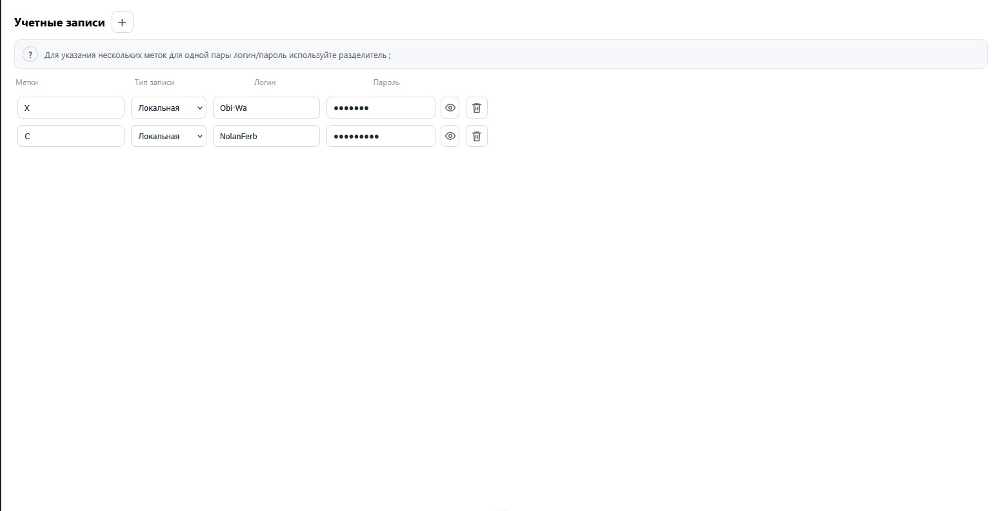

# UserRecordStore
веб-клиент для управления учетными данных клиентов с поддержкой:
- создания
- удаления
- редактирования
- меток управления

## Stack:
- Node - среда исполнения JsvsScript
- Vite - система сборки
- Vue 3 - веб-фреймворк
- Pinia - библиотека управления состоянием приложения для Vue.js
- TypeScript - язык программирования

## Превью

## Установка
Для установки и запуска проекта нужно выполнить шаги приведенные ниже

1. Кллнирование репозитория:  
    `git clone https://github.com/GhCauther101/UserRecordStore`

2. ремещение в директорию проекта веб-клиента:  
    `cd UserRecordStore/client/UserRecordStore.Web`

3. Установка зависимостей проекта:  
    `npm install`

4. Сборка проекта:  
    `npm run build`

5. Запуск:  
    `npm run preview`

## Summary
В данном репозитории размещено разработанное веб-приложение с помощью веб=фреймворка Vue.js и языка рограммирования TypeScript. Вместе с билиотекой уравления состоянием приложения Pinia